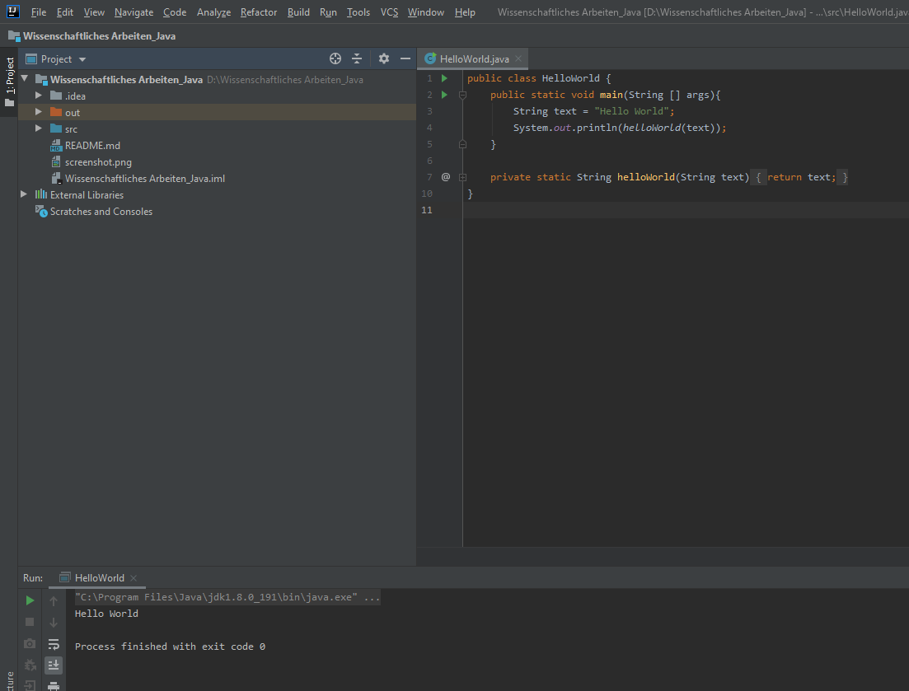

# Wissenschaftliches_Arbeiten_2020

## Voraussetzungen

Es wird lediglich eine Entwickungsumgebung für Java benötigt.

## Ausführen der Anwendung

Die "Hello World.java"-Klasse muss in der Entwicklungsumgebung ausgeführt werden.
